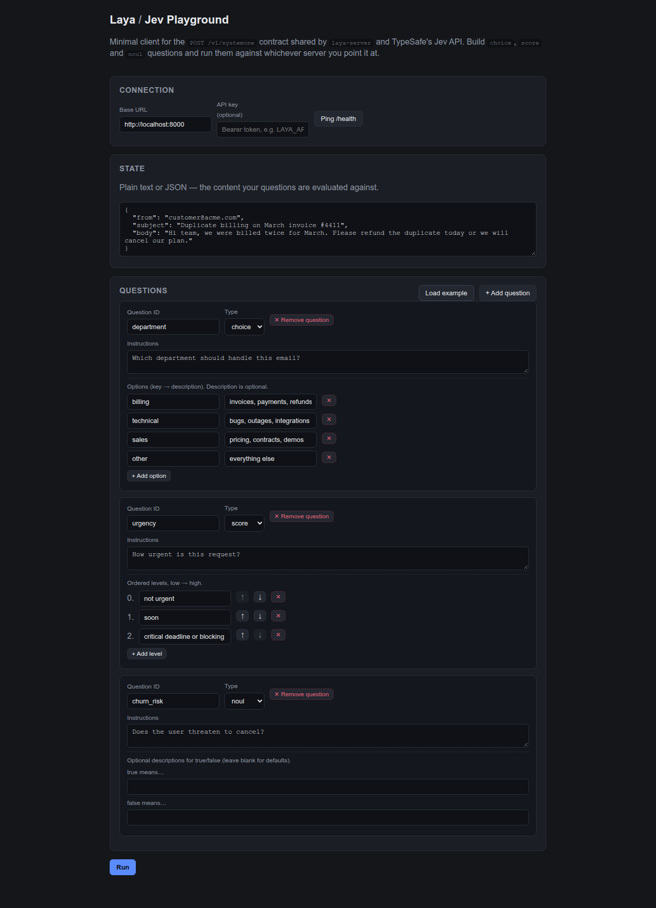
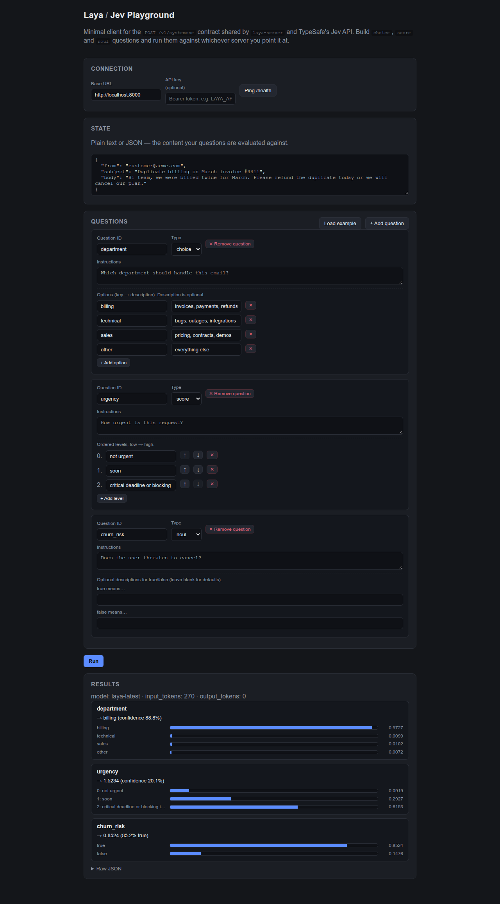

# laya-client1

A minimal, dependency-free web UI for trying out the `/v1/systemone` contract
shared by [`laya-server`](../laya-server) and TypeSafe's Jev API. Build
`choice`, `score`, and `noul` questions in a form, run them against a state,
and see the answers rendered with probability bars, plus the raw JSON.

<p align="center">
  
</p>

<p align="center">
  
</p>

## Run

Any static file server works — the app is plain HTML/CSS/JS with no build step.

```bash
cd laya-client1
python3 -m http.server 5500
```

Then open http://localhost:5500 in a browser. (Opening `index.html` directly
via `file://` also works in most browsers, since the app only talks to the API
over `fetch`.)

## Use it

1. Start `laya-server` (see `../laya-server/README.md`) — by default it listens on `http://localhost:8000`.
2. In the **Connection** panel, confirm the base URL and click **Ping /health** to check it's reachable.
   - `laya-server` already enables permissive CORS for local development.
   - To test against the real TypeSafe API instead, set the base URL to `https://api.typesafe.ai` and paste your API key — same UI, same request shape.
3. Click **Load example** to populate a sample email plus one `choice`, one `score`, and one `noul` question, or click **+ Add question** to build your own.
4. Click **Run**. Results render per-question (selected choice / score / probability), with the full JSON response available under "Raw JSON".

## Notes

- `state` accepts plain text or JSON (parsed automatically; falls back to a raw string if it doesn't parse).
- Choice `criteria` are key → description pairs (description optional). Score `criteria` are an ordered list of levels, low to high. Noul `criteria` are optional `true`/`false` descriptions.
- If `LAYA_API_KEY` is set on the server, requests need the matching key in the **API key** field.
